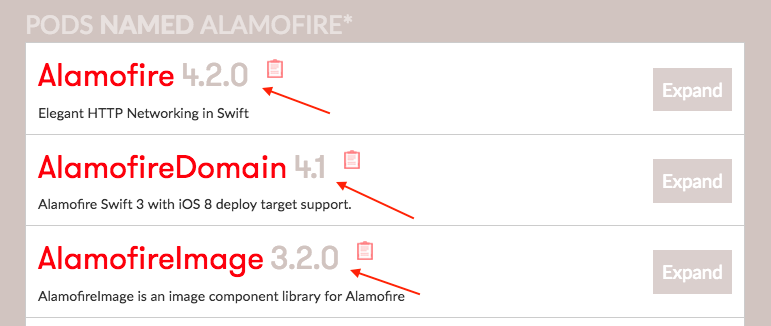
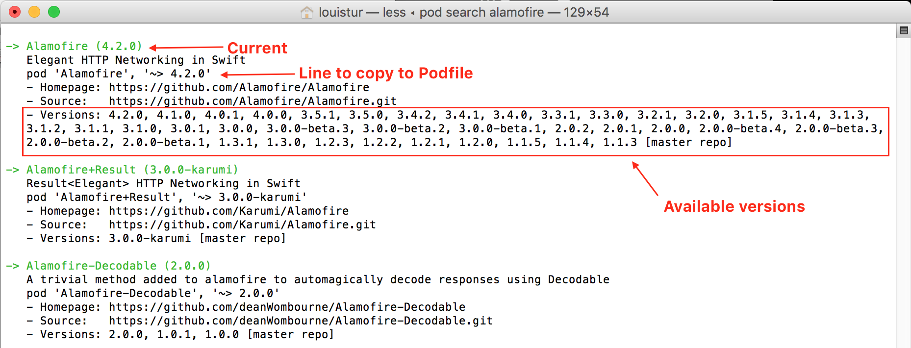
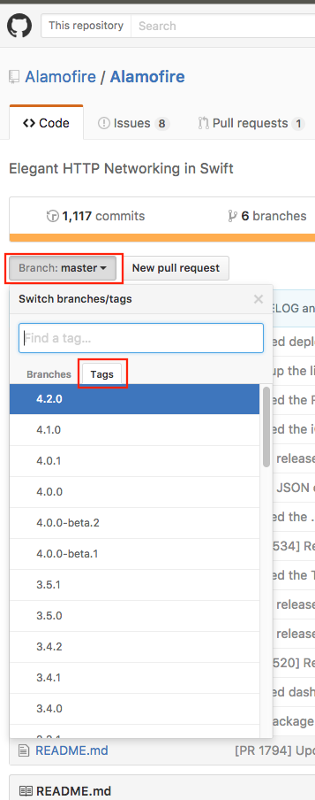

# AC3.2-CocoaPods_Intro
---

### Readings/Videos:
1. [An Introduction to Cocoapods (Route85/Google via Youtube)](https://www.youtube.com/watch?v=iEAjvNRdZa0)
1. [A Brief Intro to Cocoapods - grokswift](https://grokswift.com/cocoapods/)
2. [Getting an OAuth2.0 Token with Alamofire - grokswift](https://grokswift.com/alamofire-OAuth2/) 
3. [Cocoapods: Getting Started - Cocoapods](https://guides.cocoapods.org/using/getting-started.html)

### Reference: 
1. [Cocoapods](https://cocoapods.org/)
2. [Podfile Syntax Referece](https://guides.cocoapods.org/syntax/podfile.html)
3. [`pod` Command Line Reference](https://guides.cocoapods.org/terminal/commands.html)

### Optional: 
1. [Why I Use Libraries like Alamofire - grokswift](https://grokswift.com/i-like-libraries/)
2. [Cocoapods and the Case of the Squiggly Arrow](https://www.youtube.com/watch?v=x4ARXyovvPc)
3. [CocoaPods and Pod Try - (Route85/Google via Youtube)](https://www.youtube.com/watch?annotation_id=annotation_4056188601&feature=iv&index=18&list=PLOU2XLYxmsIKGQekfmV0Qk52qLG5LU2jO&src_vid=x4ARXyovvPc&v=tKm105KJPjQ)

### Advanced:
3. [Using a Router to Organize your API calls in Alamofire](https://grokswift.com/router/)
4. [Semantic Versioning](http://semver.org/)

---
### Installation 

#### Pre-Requisites: Installing [RubyGems](https://rubygems.org/pages/download)
1. Download package from site
2. Unpack into any directory, and `cd` to that directory in Terminal
3. Install with `ruby setup.rb`

> Note: `ruby` is built in to every Macbook. Type `ruby -v` in terminal to verify

Installing RubyGems will allow you to install [gem files](http://guides.rubygems.org/what-is-a-gem/), which are 3rd party libraries that are managed by the RubyGem org (written in Ruby). This type of library manager is called a dependancy management system, or dependancy manager for short. 

#### [Installing CocoaPods](https://guides.cocoapods.org/using/getting-started.html)
1. type `sudo gem install cocoapods` into terminal and wait for everything to download & install
2. (Optional) type `pod setup` next to download the podspec for all pods. What's a podspec, what's a pod? If you're asking, you haven't read the homework. So go do that. Right meow. 

> If you're having issues, running `sudo gem install -n /usr/local/bin cocoapods` instead may help

> If you prefer video installation: [An Introduction to Cocoapods (Route 85)](https://www.youtube.com/watch?v=iEAjvNRdZa0&spfreload=10) (cringe-worthy at times, but creative and informative).

---
### [Using Cocoapods](https://guides.cocoapods.org/using/using-cocoapods.html)
1. Create a new repository on git and clone the project locally
2. Create a new .xcodeproj in the directory of the cloned repo
3. Quit Xcode, and navigate to that same directory in Terminal
4. Type in `pod init` and wait a moment
  - This will generate some of the basic components you'll need to use/install pods, include the all important `Podfile`
5. Open the `Podfile` in the text editor of your choice
6. Add the cocoapods of your choosing, and save your changes
7. Type `pod install` in terminal and let cocoapods download the pods listed in your Podfile. 
8. When finished, it will inform you that you need to now use your project's `xcworkspace` instead of the `xcproject`
9. Open your project's `.xcworkspace` and try to Build
10. Refer to the pod's documentation or header files to determine what functions are available. 

> Note: What the heck is happening behind the scenes with all of this code running in terminal?!? Check [this](https://guides.cocoapods.org/using/using-cocoapods.html#what-is-happening-behind-the-scenes) out for info

#### [Other Considerations](https://guides.cocoapods.org/using/using-cocoapods.html#should-i-check-the-pods-directory-into-source-control): 
1. Sometimes it's good practice to add the actual `Pod/` directory to your `.gitignore` so that your repo doesn't get bloated with all of your dependancies. Committing just the [`Podfile`](https://guides.cocoapods.org/using/using-cocoapods.html#what-is-podfilelock) and `Podfile.lock` will allow other developers to pull down your code and run `pod install` on their own if they so choose. 

---
### [Updating your Pods](https://guides.cocoapods.org/using/using-cocoapods.html#when-to-use-pod-install-vs-pod-update)
1. Go into the same directory as your repo's `xcworkspace` and `Podfile` 
2. Type `pod update` in terminal

> Note: This will attemp to update your pods to the latest version. `pod install` will simply install the pods specified by your `Podfile` or in your `Podfile.lock` if you've already run `pod install` before. 

> Note: Knowing when to properly use [`install`](https://guides.cocoapods.org/using/pod-install-vs-update.html#pod-install) vs. `update` is a bit of a nuanced topic, so if you're interested you can read about it here: [`pod install` vs. `pod update`](https://guides.cocoapods.org/using/pod-install-vs-update.html)
The tl;dr (from the guide): 
 - Use pod install to install new pods in your project. Even if you already have a Podfile and ran pod install before; so even if you are just adding/removing pods to a project already using CocoaPods.
 - Use pod update [PODNAME] only when you want to update pods to a newer version.
 
 --- 
 ### [The Podfile](https://guides.cocoapods.org/using/the-podfile.html)
 
 > _The Podfile is a specification that describes the dependencies of the targets of one or more Xcode projects. The file should simply be named Podfile._
 
Podfiles usually end up being pretty simple, containing just the names of the pods you'll need, along with you minimum supported version of iOS:

> For a full list of usable syntax and examples, see the [Podfile Syntax Reference](https://guides.cocoapods.org/syntax/podfile.html)

```ruby
# Uncomment this line to define a global platform for your project
platform :ios, '9.0'

target 'CatPColoralettes' do
	use_frameworks!

	pod 'SnapKit'
	pod 'RESideMenu'
	# pod 'SwiftHSVColorPicker'

end
```

Another common practice is specifying version numbers for each of the pods using the notation `pod '<PodName>', '~> <version>': 

```ruby
# Uncomment this line to define a global platform for your project
platform :ios, '9.0'

target 'CatPColoralettes' do
	use_frameworks!

	pod 'SnapKit' , '~> 0.21.0'
	pod 'RESideMenu', '~> 4.0.7'
	# pod 'SwiftHSVColorPicker', '~> 1.0.9'

end
```

__Q: Where do you find out a pod's version number?__

A: A couple of places. You can find a pod's version number:

#### Searching for it on the Cocoapod's site.


#### Searching through terminal.


#### Searching the Github repo via its tags.


---

### Exercises:

__Setup__
Using this repo to practice working with Pods, perform the following:

1. Fork this repo, clone it locally, and add a new Xcode project. Name it `CatPods`
2. Initialize you pods setup by running `pod init`
3. Open the `Podfile`

__Adding Pods__
After each step, verify you were able to complete the exercise by opening your `xcworkspace` and inspecting the `pod` project and your `Podfile.lock`. Then close Xcode before the next step

1. Add Alamofire to your project, do not specify the version
2. Now, specify that you want to use version `4.0.1`
3. Now, specify that you'd like to use any version higher than `3.5`
4. Now, specify that you'd like to use any version less than or equal to `4.0.0`
5. Now, specify that you'd like to use any version `3.0` and higher, not including `4.0`
6. Now, specify that you'd like to use any version `4.0` and higher, not including `4.1`
7. Finally, specify that you'd like to use any version `4.2` and higher, not including `5.0`

__Trying Pods__
See video linked above and try out Alamofire.

---

### (Brief) [Semantic Versioning](http://semver.org/), or, "What do all those version numbers mean?"

Given a version number `MAJOR.MINOR.PATCH`, increment the:

1. `MAJOR` version when you make incompatible API changes,
2. `MINOR` version when you add functionality in a backwards-compatible manner, and
3. `PATCH` version when you make backwards-compatible bug fixes.

Additional labels for pre-release and build metadata are available as extensions to the MAJOR.MINOR.PATCH format.

---

### Using AlamoFire to make web requests

Alamofire certainly can simplify a few things when making web requests, but you'll find that things look pretty familiar in terms of what needs to be done. Let's take a look at making a request on an API we've already worked with, the RandomUser API:

```swift
  Alamofire.request("https://randomuser.me/api").responseJSON { dataResponse in
    print("Request: \(dataResponse.request)")
    print("Response: \(dataResponse.response)")
    print("Data: \(dataResponse.data)")
    print("Result: \(dataResponse.result)")
     
    if let json = dataResponse.result.value {
      print("Json: \(json)") // as the documentation points out, the json response handler makes use of JSONSerialization to parse out objects. meaning that this json is of type Any
    }
```

The console output of the above looks like: 

```
Request: Optional(https://randomuser.me/api)
Response: Optional(<NSHTTPURLResponse: 0x60800003bc80> { URL: https://randomuser.me/api } { status code: 200, headers {
    "Access-Control-Allow-Origin" = "*";
    "Cache-Control" = "no-cache";
    "Content-Encoding" = gzip;
    "Content-Type" = "application/json; charset=utf-8";
    Date = "Tue, 29 Nov 2016 04:56:46 GMT";
    Etag = "W/\"38a-gRoNGhQROcv22BV8lml6wA\"";
    Server = "cloudflare-nginx";
    "Set-Cookie" = "__cfduid=d3e46c15387db68d7436c9ff46bce69e01480395406; expires=Wed, 29-Nov-17 04:56:46 GMT; path=/; domain=.randomuser.me; HttpOnly";
    Vary = "Accept-Encoding";
    "cf-ray" = "30937999eaca21f2-EWR";
    "x-powered-by" = Express;
} })
Data: Optional(906 bytes)
Result: SUCCESS
Json: {
    info =     {
        page = 1;
        results = 1;
        seed = 17d52321d4956f27;
        version = "1.1";
    };
    results =     (
                {
            cell = "040-193-43-59";
            dob = "1974-07-09 05:26:03";
            email = "sanni.manni@example.com";
            gender = female;
            id =             {
                name = HETU;
                value = "874-3284";
            };
            location =             {
                city = pornainen;
                postcode = 84143;
                state = "southern ostrobothnia";
                street = "2222 fredrikinkatu";
            };
            login =             {
                md5 = af62b68bfb87437fc100daa6b199f612;
                password = orion;
                salt = 5uafBvvs;
                sha1 = 61848c628bc1b2ee91adfde6e622b146f48faa24;
                sha256 = 11a0182639cc330e97d87c5dad022862371b84fd795b1c57732028376ccf772a;
                username = greenlion205;
            };
            name =             {
                first = sanni;
                last = manni;
                title = mrs;
            };
            nat = FI;
            phone = "08-374-308";
            picture =             {
                large = "https://randomuser.me/api/portraits/women/68.jpg";
                medium = "https://randomuser.me/api/portraits/med/women/68.jpg";
                thumbnail = "https://randomuser.me/api/portraits/thumb/women/68.jpg";
            };
            registered = "2002-12-14 17:14:34";
        }
    );
}
```

--- 
### The importance of reading documentation

By now, we understand that a certain level of error handling is needed when making web requests. But here's a deviation in how [validation is done with Alamofire](https://github.com/Alamofire/Alamofire#response-validation) as compared to how we've been doing it (for the better): 

> By default, Alamofire treats any completed request to be successful, regardless of the content of the response. Calling validate before a response handler causes an error to be generated if the response had an unacceptable status code or MIME type.

What does this mean for our code? Well, it just means we need to adapt to our new tool by using "automatic" validation:

> Automatically validates status code within `200...299` range, and that the `Content-Type` header of the response matches the `Accept` header of the request, if one is provided

```swift
    Alamofire.request("https://randomuser.me/api").validate().responseJSON { dataResponse in
      
      switch dataResponse.result {
      case .success:
        print("Validation success!")
      case .failure(let error):
        print("Encountered an error: \(error)")
      }
      
    }
```

```
// on success:
"Validation success!"

// on failure by mistyping the URL:
"Encountered an error: Error Domain=NSURLErrorDomain Code=-1003 "A server with the specified hostname could not be found." UserInfo={NSUnderlyingError=0x600000052690 {Error Domain=kCFErrorDomainCFNetwork Code=-1003 "(null)" UserInfo={_kCFStreamErrorCodeKey=0, _kCFStreamErrorDomainKey=0}}, NSErrorFailingURLStringKey=https://raner.me/api, NSErrorFailingURLKey=https://raner.me/api, _kCFStreamErrorDomainKey=0, _kCFStreamErrorCodeKey=0, NSLocalizedDescription=A server with the specified hostname could not be found.}"
```
---
### Well, What about the other stuff?

#### HTTP Methods: Yup covers that too!

```swift
Alamofire.request("https://jsonplaceholder.typicode.com/posts", method: .post)
  .validate()
  .responseJSON { response in
    if let json = response.result.value {
      print("Returned JSON: \(json)")
    }
  }
```
```
// prints: 
Returned JSON: {
    id = 101;
}
```

#### HTTP Body: I knew you were wondering!

```     
// Parameters is a typealias for [String : Any]
let placeholderParams: Parameters = [
      "title" : "Dubious Facts",
      "body" : "Coconuts are mammals because they have hair and produce milk.",
      "userId" : 1
    ]
    
Alamofire.request("https://jsonplaceholder.typicode.com/posts", method: .post, parameters: placeholderParams, encoding: URLEncoding.methodDependent)
  .validate()
  .responseJSON { response in
      if let json = response.result.value {
        print("Returned JSON: \(json)")
      }
    }
```
```
// prints
Returned JSON: {
    body = "Coconuts are mammals because they have hair and produce milk.";
    id = 101;
    title = "Dubious Facts";
    userId = 1;
}
```

Am I done blowing your mind? Not even close. 

#### HTTP Headers: Brace yourselves!

``` swift 
// HTTPHeaders is type [String : String]
let placeholderHeaders: HTTPHeaders = [
  "Accept": "application/json"
]
    
Alamofire.request("https://jsonplaceholder.typicode.com/posts", method: .post, parameters: placeholderParams, encoding: URLEncoding.methodDependent, headers: placeholderHeaders)
  .validate()
  .responseJSON { (response) in
      // you get the picture
  }
```

---
### Exercises


